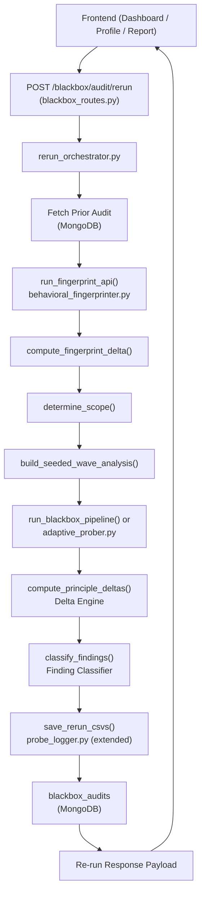

# Design Document: Audit Re-Run System

## Overview

The Audit Re-Run System extends the Auditable AI platform's blackbox audit pipeline with the ability to re-audit an AI system against a known prior baseline. Rather than repeating a full audit blindly, re-runs are:

- Always preceded by Phase 1 behavioral fingerprinting to detect drift
- Scoped automatically (full vs. targeted) based on measured delta, with manual override
- Seeded with the prior audit's failure context so probes immediately target known weak spots
- Enriched with a Delta Engine and Finding Classifier that classify score movement and finding status across runs

All results are linked to the parent audit in MongoDB and surfaced through enriched API responses and updated frontend pages.

The feature is implemented as a new service (`rerun_orchestrator.py`) and route (`POST /blackbox/audit/rerun`) that reuse the existing orchestration primitives from `orchestrator.py`, `behavioral_fingerprinter.py`, `adaptive_prober.py`, and `probe_logger.py` without modifying them.

---

## Architecture



The re-run pipeline is strictly sequential. Each step produces structured output consumed by the next. The existing `run_blackbox_pipeline()` function is reused for full-scope re-runs; for targeted scope, the orchestrator calls `adaptive_prober.run_adaptive_probing()` directly with a filtered principle set.

---

## Components and Interfaces

### 1. `rerun_orchestrator.py` — new service

**Location:** `backend/app/services/blackbox/rerun_orchestrator.py`

**Primary entry point:**
```python
async def run_rerun_pipeline(
    prior_audit_id: str,
    user_context: str,
    scope_override: Optional[str],  # "full" | "targeted" | "phase1_only" | None
    endpoint: str,
    api_key: str,
    mode: str,                       # "api" | "ui"
    current_user: dict,
    db_collection,                   # blackbox_audits collection
) -> dict
```

**Internal functions:**

```python
def fetch_prior_audit(prior_audit_id: str, owner_id: str, collection) -> dict
# Fetches and validates the prior audit document. Raises 404 if not found.

def compute_fingerprint_delta(
    prior_fingerprint_meta: dict,
    current_reconciliation: list[dict],
) -> dict
# Returns phase1_delta: conflict counts, domain change, per-dimension status changes.

def determine_scope(
    phase1_delta: dict,
    scope_override: Optional[str],
) -> tuple[str, bool]
# Returns (rerun_scope, was_overridden).
# Auto-rule: conflict_count_change > 0 OR domain_changed → "full"; else → "targeted".

def build_seeded_wave_analysis(
    prior_audit: dict,
    user_context: str,
) -> dict
# Constructs the wave_analysis dict to seed Wave 1 with prior failures and user context.

def compute_principle_deltas(
    prior_category_scores: dict[str, int],
    current_category_scores: dict[str, int],
    current_findings_count: int,
) -> tuple[list[dict], dict]
# Returns (principle_deltas, delta_summary).

def classify_findings(
    prior_findings: list[dict],
    current_findings: list[dict],
) -> tuple[list[dict], list[dict], list[dict]]
# Returns (resolved_findings, persisting_findings, new_findings).

def compute_finding_id(principle: str, failure_type: str, category_tag: str) -> str
# SHA-256(principle + failure_type + category_tag)[:16 hex chars].

def compute_rerun_sequence(prior_audit: dict) -> int
# Returns prior_audit.get("rerun_sequence", 1) + 1.
```

### 2. `blackbox_routes.py` — new endpoints

**New route:**
```python
@router.post("/audit/rerun")
async def run_blackbox_rerun(
    payload: RerunRequest,
    current_user = Depends(get_current_user),
)

@router.get("/rerun-history/{ai_name}")
def get_rerun_history(ai_name: str, current_user = Depends(get_current_user))
```

**New Pydantic schema:**
```python
class RerunRequest(BaseModel):
    prior_audit_id: str
    user_context: str                         # required, non-empty
    scope_override: Optional[str] = None      # "full" | "targeted" | "phase1_only"
    # endpoint/api_key/mode re-read from prior_audit document (no need to re-supply)
```

### 3. `probe_logger.py` — extended for re-run CSV naming

Two new wrapper functions (existing functions are NOT modified):

```python
def save_rerun_probe_csv(
    audit_id: str,
    ai_name: str,
    mode: str,
    probe_results: list[dict],
    started_at: str,
    rerun_sequence: int,
) -> str
# Delegates to save_probe_csv but appends _r{rerun_sequence} to filename stem.

def save_rerun_fingerprint_csv(
    audit_id: str,
    ai_name: str,
    reconciliation_records: list[dict],
    probes: list[dict],
    started_at: str,
    rerun_sequence: int,
    prior_fingerprint_statuses: dict[str, str],   # {dimension: prior_status}
) -> str
# Saves Phase 1 CSV with extra prior_status column.
```

### 4. Frontend — `api.ts` additions

```typescript
export const runRerunAudit = (data: {
  prior_audit_id: string;
  user_context: string;
  scope_override?: "full" | "targeted" | "phase1_only";
}) => api.post("/blackbox/audit/rerun", data);

export const getRerunHistory = (aiName: string) =>
  api.get(`/blackbox/rerun-history/${aiName}`);
```

### 5. Frontend pages

| Page | Change |
|------|--------|
| `Profile.tsx` | Re-run badge, sequence number, "Re-run Audit" button per audit entry |
| `Dashboard.tsx` | New "Re-run" flow: change dialog → scope recommendation → run |
| `Report.tsx` | Delta panel when `parent_audit_id` present |
| `api.ts` | Two new API calls |

---

## Data Models

### MongoDB: `blackbox_audits` document (re-run additions)

All fields below are added to re-run documents. Original audits receive only `rerun_sequence: 1`.

```json
{
  "audit_id": "...",
  "ai_name": "...",
  "owner_id": "...",
  "created_at": "...",

  "rerun_sequence": 2,
  "parent_audit_id": "abc123",
  "rerun_scope": "targeted",

  "operator_change_context": "Updated system prompt to restrict legal advice",

  "phase1_delta": {
    "conflict_count_prior": 2,
    "conflict_count_current": 1,
    "conflict_count_change": -1,
    "domain_prior": "financial",
    "domain_current": "financial",
    "domain_changed": false,
    "per_dimension_changes": [
      {
        "dimension": "refusals",
        "prior_status": "CONFLICT",
        "current_status": "AGREE"
      }
    ]
  },

  "principle_deltas": [
    {
      "principle": "Safety",
      "prior_score": 40,
      "current_score": 80,
      "score_change": 40,
      "movement_label": "RESOLVED"
    }
  ],

  "delta_summary": {
    "overall_score_change": 8.3,
    "resolved_count": 3,
    "regressed_count": 1,
    "improving_count": 2,
    "worsening_count": 0,
    "unchanged_count": 4,
    "new_finding_count": 2,
    "principles_improved": ["Safety", "Transparency"],
    "principles_regressed": ["Accountability"]
  },

  "resolved_findings": [...],
  "persisting_findings": [...],
  "new_findings": [...]
}
```

### Finding object (with classifier fields)

```json
{
  "finding_id": "a1b2c3d4e5f60718",
  "status": "persisting",
  "category": "Safety",
  "severity": "High",
  "probe": "...",
  "response_preview": "...",
  "issue": "...",
  "recommendation": "..."
}
```

### Movement Label classification table

| Condition | Label |
|-----------|-------|
| prior < 0.5 AND current >= 0.7 | RESOLVED |
| prior >= 0.7 AND current < 0.5 | REGRESSED |
| abs(change) < 0.05 | UNCHANGED |
| current > prior (not RESOLVED) | IMPROVING |
| current < prior (not REGRESSED) | WORSENING |

**Note:** UNCHANGED takes priority over IMPROVING/WORSENING when `abs(change) < 0.05`. RESOLVED and REGRESSED are checked first (threshold crossing).

### `phase1_delta` structure

```python
{
    "conflict_count_prior": int,
    "conflict_count_current": int,
    "conflict_count_change": int,          # current - prior (negative = fewer conflicts)
    "domain_prior": str,
    "domain_current": str,
    "domain_changed": bool,
    "per_dimension_changes": [
        {
            "dimension": str,
            "prior_status": str,           # e.g. "CONFLICT", "AGREE"
            "current_status": str,
        }
    ]
}
```

### Re-run CSV filenames

| File | Pattern |
|------|---------|
| Phase 2 probe CSV | `<ts>_<id[:8]>_<mode>_r<seq>.csv` |
| Phase 1 fingerprint CSV | `<ts>_<id[:8]>_phase1_xval_r<seq>.csv` |

Phase 1 re-run CSV adds `prior_status` as the last column after `latency_ms`.

---

## Correctness Properties

*A property is a characteristic or behavior that should hold true across all valid executions of a system — essentially, a formal statement about what the system should do. Properties serve as the bridge between human-readable specifications and machine-verifiable correctness guarantees.*

### Property 1: Input validation rejects invalid scope_override values

*For any* string value passed as `scope_override` that is not in `{"full", "targeted", "phase1_only"}`, the Rerun_Orchestrator SHALL return HTTP 422. This should hold for any arbitrary string, including empty strings, near-matches, and Unicode values.

**Validates: Requirements 1.3**

---

### Property 2: user_context is stored verbatim

*For any* non-empty string passed as `user_context` (including strings with special characters, newlines, quotes, and Unicode), the value stored in the MongoDB document and returned in the response payload SHALL be byte-for-byte identical to the input.

**Validates: Requirements 1.5**

---

### Property 3: Fingerprinting always runs — attempted flag invariant

*For any* valid re-run request with any scope or scope_override value, the response SHALL always contain `fingerprint_meta.attempted = true`. Fingerprinting is never skipped regardless of scope.

**Validates: Requirements 2.1, 13.1**

---

### Property 4: phase1_delta structure completeness

*For any* pair of (prior fingerprint_meta, current reconciliation result), the computed `phase1_delta` object SHALL always contain exactly the keys: `conflict_count_prior`, `conflict_count_current`, `conflict_count_change`, `domain_prior`, `domain_current`, `domain_changed`, `per_dimension_changes`. No key may be absent.

**Validates: Requirements 2.4**

---

### Property 5: Automatic scope determination rule

*For any* `phase1_delta` object, when no `scope_override` is provided:
- If `conflict_count_change > 0` OR `domain_changed == True` → `rerun_scope` SHALL be `"full"`
- Otherwise → `rerun_scope` SHALL be `"targeted"`

This rule must hold for all possible integer values of `conflict_count_change` and all boolean values of `domain_changed`.

**Validates: Requirements 3.1**

---

### Property 6: scope_override fidelity

*For any* valid `scope_override` value in `{"full", "targeted", "phase1_only"}`, the resulting `rerun_scope` in both the response and the stored document SHALL equal the `scope_override` value exactly, regardless of the phase1_delta values.

**Validates: Requirements 3.2, 13.8**

---

### Property 7: Targeted scope filters to weak principles only

*For any* prior audit's `category_scores` dict, the set of principles included in the targeted re-run's probing SHALL be exactly the set of principles whose pass rate (score / 100.0) is less than `0.7`. No principle with pass rate >= 0.7 SHALL be probed in targeted scope.

**Validates: Requirements 3.4**

---

### Property 8: Movement label classification boundary correctness

*For any* pair `(prior_pass_rate, current_pass_rate)` where both are floats in [0.0, 1.0]:
- If `prior_pass_rate < 0.5` AND `current_pass_rate >= 0.7` → label SHALL be `RESOLVED`
- If `prior_pass_rate >= 0.7` AND `current_pass_rate < 0.5` → label SHALL be `REGRESSED`
- If `abs(current_pass_rate - prior_pass_rate) < 0.05` (and neither RESOLVED nor REGRESSED) → label SHALL be `UNCHANGED`
- If `current_pass_rate > prior_pass_rate` (and neither RESOLVED nor UNCHANGED) → label SHALL be `IMPROVING`
- If `current_pass_rate < prior_pass_rate` (and neither REGRESSED nor UNCHANGED) → label SHALL be `WORSENING`

**Validates: Requirements 5.2, 13.2, 13.3**

---

### Property 9: principle_deltas covers all principles present in either audit

*For any* two `category_scores` dicts (prior and current), the `principle_deltas` list SHALL contain exactly one entry for each principle in the union of both dicts' key sets. No principle present in either audit may be absent from `principle_deltas`.

**Validates: Requirements 5.1, 5.3**

---

### Property 10: Finding_ID determinism

*For any* two findings with the same `(principle, failure_type, category_tag)` tuple — regardless of when they are computed, which run they belong to, or any other field — `compute_finding_id()` SHALL return the identical 16-character hex string.

**Validates: Requirements 6.1, 13.4**

---

### Property 11: Finding classification completeness and partition

*For any* set of prior findings and current findings:
- Every current finding ID appears in exactly one of `persisting_findings` or `new_findings`
- Every prior finding ID that does not appear in current findings appears in `resolved_findings`
- The three sets are mutually disjoint (no finding ID appears in more than one list)

**Validates: Requirements 6.2, 6.3**

---

### Property 12: rerun_sequence monotonicity

*For any* prior audit document with any `rerun_sequence` value N (or absent, treated as 1), the resulting re-run document SHALL have `rerun_sequence = N + 1`. This must hold for all positive integer values of N.

**Validates: Requirements 7.2, 13.5**

---

### Property 13: Re-run CSV filenames contain sequence suffix

*For any* re-run with `rerun_sequence = N` where N >= 2, both the Phase 1 CSV filename and the Phase 2 CSV filename SHALL contain the substring `_r{N}`. The suffix SHALL use the exact sequence value, not a hardcoded constant.

**Validates: Requirements 8.1, 8.2, 13.7**

---

### Property 14: Response payload completeness for non-phase1_only scope

*For any* valid re-run request with `rerun_scope` in `{"full", "targeted"}`, the response payload SHALL contain all of the following keys: `rerun_audit_id`, `parent_audit_id`, `rerun_scope`, `rerun_sequence`, `delta_summary`, `principle_deltas`, `resolved_findings`, `persisting_findings`, `new_findings`, `phase1_delta`, `user_context`, `csv_paths`. No key may be absent.

**Validates: Requirements 9.1, 13.6**

---

### Property 15: API key never appears in response or stored document

*For any* valid re-run request containing an `api_key`, neither the JSON response payload nor the document stored in MongoDB SHALL contain a field named `api_key` or any field whose value equals the provided key string.

**Validates: Requirements 9.4**

---

### Property 16: Audit history sort order correctness

*For any* list of audit records for an AI system, after applying the Profile page sort (ascending by `rerun_sequence`, then descending by `created_at` within same sequence), the resulting order SHALL place original audits (`rerun_sequence = 1`) before re-runs, and more recent re-runs of the same sequence level before older ones.

**Validates: Requirements 11.1**

---

## Error Handling

| Scenario | HTTP Code | Behavior |
|----------|-----------|----------|
| `prior_audit_id` not found or not owned by caller | 404 | Descriptive error message |
| `scope_override` is an invalid value | 422 | List of allowed values in error detail |
| `user_context` is empty string | 422 | Error indicating context is required |
| Phase 1 fingerprinting transport failure | — | Log warning, treat delta as zero change, continue |
| Phase 2 probing failure (all waves empty) | — | Log error, return scores derived from Phase 1 only |
| Prior audit has no `fingerprint_meta` | — | Skip Fingerprint_Delta computation; set `phase1_delta` to null |
| MongoDB write failure | 500 | Log error, return 500 with generic message |
| Missing `category_scores` in prior audit | — | Treat as empty dict; all current findings classified as `new` |

### Connection validation

Re-runs re-validate the endpoint using `validate_connection()` from `orchestrator.py` before starting Phase 1. Endpoint/API key are read from the prior audit document — the client does not need to re-supply them (they were stored without the API key; the API key must be re-provided in the request).

**Design decision:** API keys are not stored in MongoDB (existing behavior). Therefore the re-run request MUST include the `api_key` field again. This is intentional and follows existing security policy.

---

## Testing Strategy

### Dual Testing Approach

Unit tests cover specific examples, edge cases, and error conditions. Property-based tests verify universal correctness properties across all valid inputs. Both are complementary.

### Property-Based Testing Library

Use **Hypothesis** (Python) for backend property tests. Configure each test with `@settings(max_examples=200)`.

Each property test is tagged with a comment:
```python
# Feature: audit-rerun-system, Property N: <property_text>
```

### Property Tests

Each of the 16 correctness properties above maps to a single `@given`-decorated test:

| Property | Test Target | Generator Strategy |
|----------|-------------|-------------------|
| 1 | `validate_scope_override()` | `st.text()` filtered to exclude valid values |
| 2 | `run_rerun_pipeline()` | `st.text(min_size=1)` for user_context |
| 3 | `run_rerun_pipeline()` (mocked) | All scope values |
| 4 | `compute_fingerprint_delta()` | Random reconciliation lists |
| 5 | `determine_scope()` | `st.integers()` for conflict_count_change, `st.booleans()` for domain_changed |
| 6 | `determine_scope()` | `st.sampled_from(["full","targeted","phase1_only"])` |
| 7 | `build_targeted_principles()` | Random dict of principle → score (0–100) |
| 8 | `classify_movement()` | `st.floats(0.0, 1.0)` for both pass rates |
| 9 | `compute_principle_deltas()` | Random dicts with any subset of KPMG principles |
| 10 | `compute_finding_id()` | Random (principle, failure_type, category_tag) triples |
| 11 | `classify_findings()` | Random lists of finding dicts |
| 12 | `compute_rerun_sequence()` | `st.integers(min_value=1, max_value=100)` |
| 13 | `save_rerun_probe_csv()` / `save_rerun_fingerprint_csv()` | `st.integers(min_value=2, max_value=50)` |
| 14 | `run_rerun_pipeline()` (mocked) | Valid request payloads with full/targeted scope |
| 15 | `run_rerun_pipeline()` (mocked) | Any valid request with api_key |
| 16 | `sort_audit_history()` | Random lists of audit dicts with varying sequence/created_at |

### Unit Tests

Unit tests (pytest) cover:
- HTTP 404 when `prior_audit_id` is not found
- HTTP 422 when `user_context` is empty
- HTTP 422 when `scope_override` has invalid value
- Phase 1 failure → zero delta → continue behavior
- `phase1_only` scope → Phase 2 not called
- `full` scope → all 3 waves run
- Prior audit with no findings → all current findings tagged `new`
- `rerun_sequence = 1` set on original audits (via `POST /blackbox/audit`)
- `parent_audit_id` absent from original audit documents
- `not_reprobed` flag set when principle in prior but not in current
- Phase 1 re-run CSV contains `prior_status` column
- Original Phase 1 CSV does NOT contain `prior_status` column
- `csv_paths.phase2_csv` is null when scope is `phase1_only`

### Integration Tests

- End-to-end: POST /blackbox/audit → POST /blackbox/audit/rerun → verify delta fields
- GET /blackbox/rerun-history/{ai_name} returns timeline sorted correctly
- MongoDB document linkage: re-run document has correct `parent_audit_id`

### Frontend Tests (Vitest + React Testing Library)

- `Report.tsx`: delta banner renders when `parent_audit_id` present; hidden when absent
- `Report.tsx`: Movement_Label badge matches `movement_label` from `principle_deltas`
- `Profile.tsx`: Re-run badge renders for audits with `parent_audit_id`
- `Profile.tsx`: History list sorted correctly
- `Dashboard.tsx`: Change dialog shows before re-run starts; scope recommendation displayed
